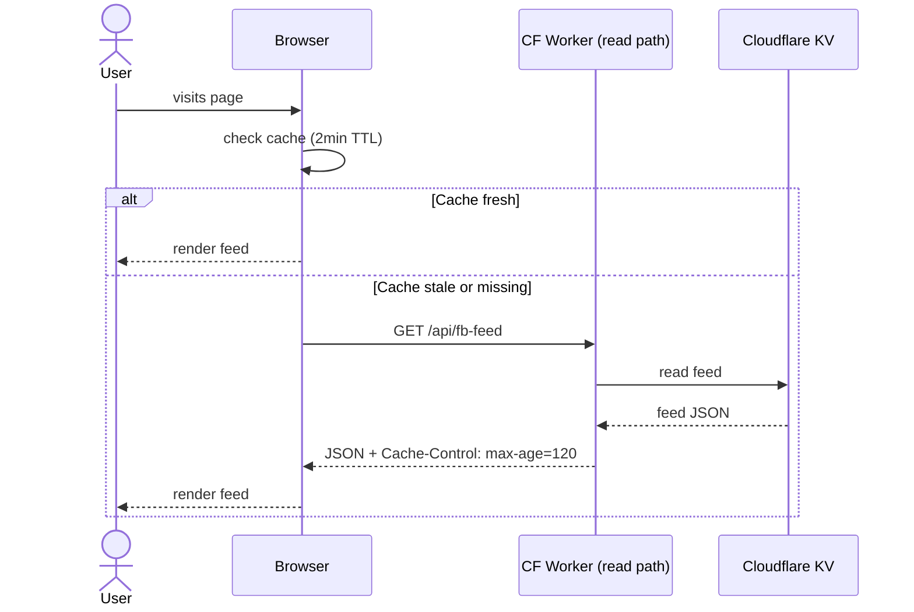
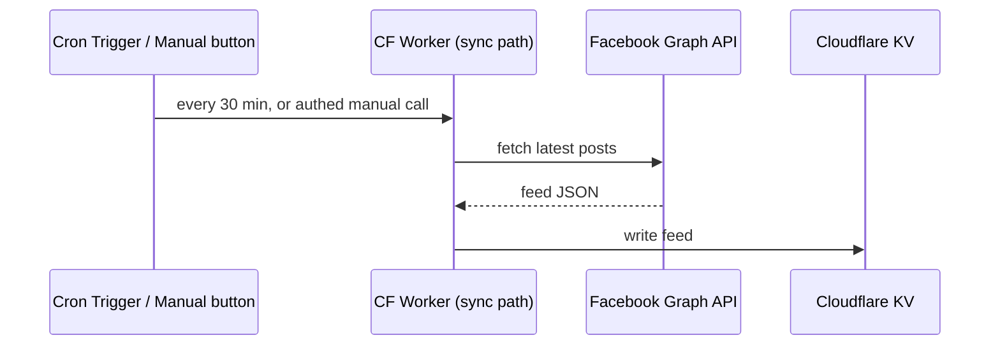

# Aurora Colony Pub Website

The main website for the Aurora Colony Pub.

## Infrastructure

- Focus is on incredibly performant frontend with outstanding SEO. So we use [Astro](https://astro.build/).
- Islands will use Svelte for the clean reactivity and compile-based output step. No shadow-DOM.
- For content that is dynamic, we use a backend of serverless functions. CloudFlare workers seems to be the plan. [Link to docs on the free-tier limits](https://developers.cloudflare.com/workers/platform/limits/).

### Facebook Feed Pipeline

The feed is served via a two-pipeline design so visitors never wait on Facebook and we stay well inside free-tier limits.

**Read path** (every page view):

**Sync path** (independent, refreshes KV):

- **Read path** never calls Facebook — it only reads from KV.
- **Sync path** is the only thing that talks to Facebook. Cron fires every 30 minutes; a protected manual endpoint lets us force a refresh ahead of demos or right after a new post.
- Browser cache + KV together mean Facebook is called at most ~48 times/day from cron, plus the occasional manual sync.

### Deployment

- Uses GitHub Actions for most of the build process to keep things centralized
