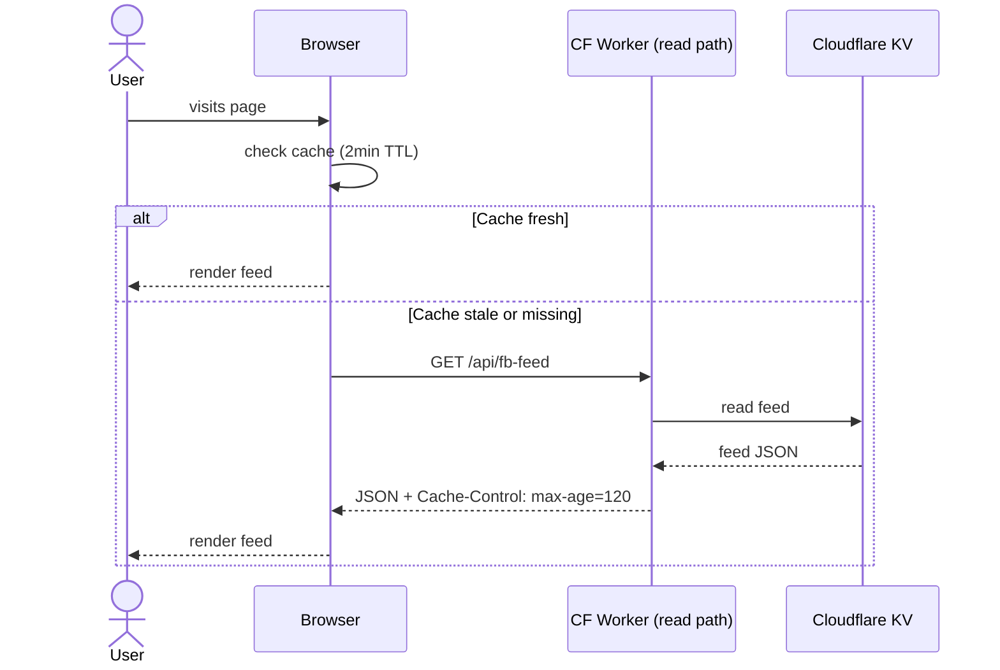
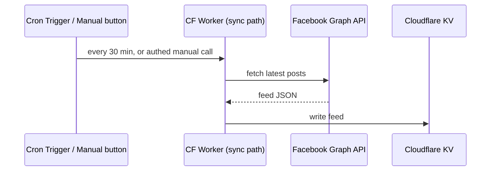
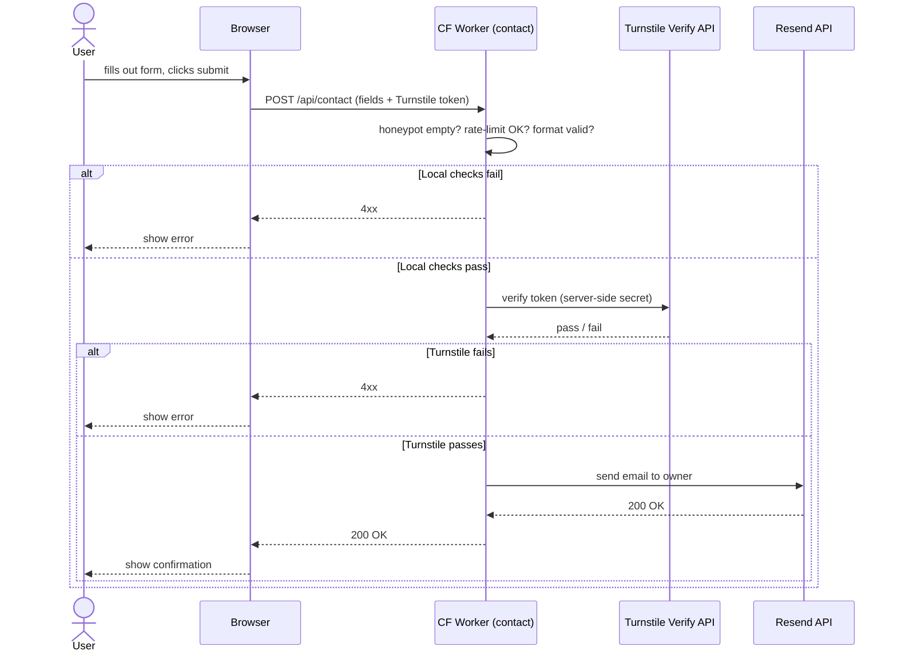
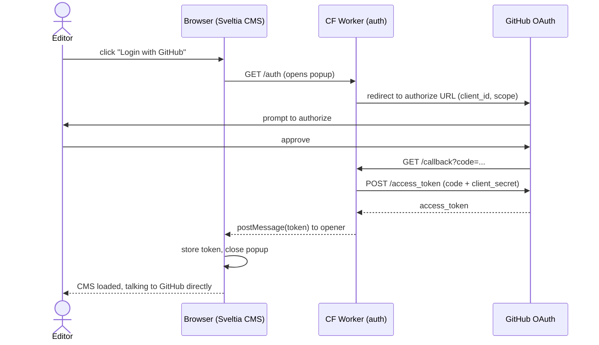

# CloudFlare Worker Details

This lists out the sequence diagrams and process flows for each worker

## Facebook Feed Workers (2 Workers)

The feed is served via a two-pipeline design so visitors never wait on Facebook and we stay well inside free-tier limits.

**Worker 1: Read path** (every page view):

**Worker 2: Sync path** (independent, refreshes KV):

- **Read path** never calls Facebook — it only reads from KV.
- **Sync path** is the only thing that talks to Facebook. Cron fires every 30 minutes; a protected manual endpoint lets us force a refresh ahead of demos or right after a new post.
- Browser cache + KV together mean Facebook is called at most ~48 times/day from cron, plus the occasional manual sync.

## Form Worker (1 Worker)

A single Worker handles contact form submissions. Defenses run cheapest-first so obvious garbage bails out before any network calls.

- Local checks (honeypot, rate-limit, format validation) run first so garbage requests never trigger an outbound API call.
- Turnstile verification uses the secret key server-side. Only the public sitekey is ever exposed in the browser.
- Resend handles email delivery to the owner. The customer's address goes in `Reply-To` so the owner can respond directly from their inbox.
- If Resend returns a 5xx (rare), the Worker propagates a 5xx so the form can surface a retry-friendly error to the user.

## CMS Auth Worker (1 Worker)

A drop-in deployment of [`sveltia/sveltia-cms-auth`](https://github.com/sveltia/sveltia-cms-auth) that completes the GitHub OAuth handshake for the Sveltia CMS admin UI. The client secret can't live in the browser, so this Worker is the server-side half of the [authorization code flow](https://sveltiacms.app/en/docs/backends/github#authorization-code-flow).

- Only runs during login, so it sits well inside free-tier limits.
- After login the browser talks straight to the GitHub API with the token — the Worker is not in the read/write path for CMS content.
- The GitHub OAuth App's client secret lives only in the Worker's environment, never in the static site bundle.
